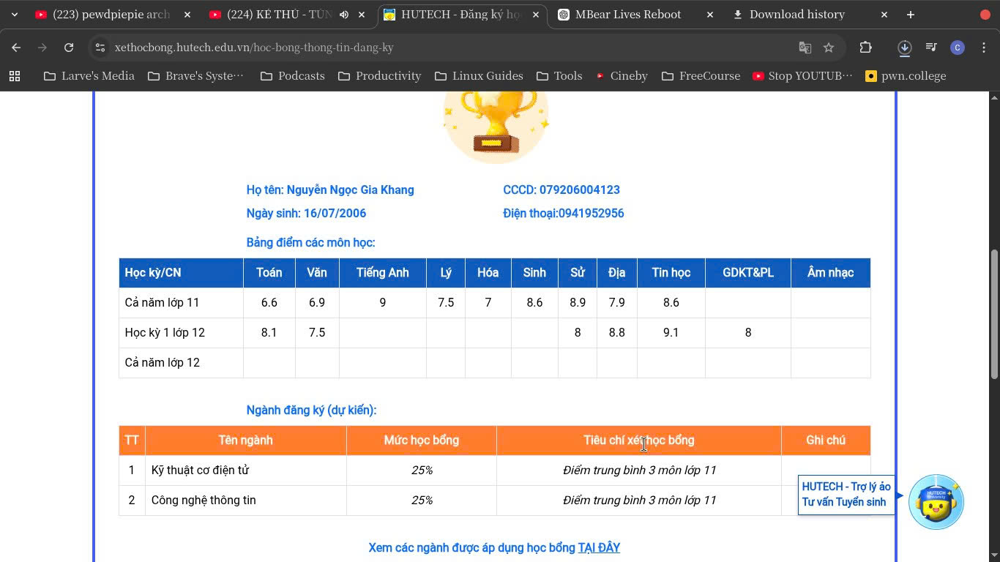

# 内核幽灵 · Kernel Ghost · Nhân Lõi Ma · 커널 고스트

### 叛逆工程师 · Rebel Engineer · Kỹ sư hệ thống định hướng AI · 반항적인 엔지니어

---

## 🧠 身份 | Identity | Bản Thân | 정체성

**代码优先 · Code First · Ưu tiên mã nguồn · 코드 우선**
**系统思维 · Systems Thinking · Tư duy hệ thống · 시스템 사고**

我是一名以数学为核心的计算机科学学习者，
专注于人工智能与系统工程的发展。

I am a mathematics-driven computer science learner
building toward AI and systems engineering.

Tớ là một người học CS lấy toán học làm nền tảng,
định hướng phát triển trong AI và kỹ thuật hệ thống.

저는 수학을 기반으로 한 컴퓨터 과학 학습자로,
인공지능과 시스템 공학을 향해 성장하고 있습니다.

---

| Môn       | Điểm kiểm tra thường xuyên | Giữa kì | Cuối kì | HK1 | HK2 | Cuối Năm |
| --------- | -------------------------- | ------- | ------- | --- | --- | -------- |
| Toán      | 9, 10, 10, 9               | 10      | 9.8     | 9.6 | 9.7 | 9.7      |
| Vật lí    | 10, 8, 9                   | 9.5     | 9.3     | 7.9 | 9.2 | 8.8      |
| Hoá học   | 8, 10, 10                  | 9.3     | 9.8     | 9.4 | 9.5 | 9.5      |
| Sinh học  | 9, 8, 10                   | 9.3     | 9.5     | 8.4 | 9.3 | 9.5      |
| Ngữ văn   | 8, 8, 9, 9                 | 7       | 8.5     | 7.9 | 8.2 | 8.1      |
| Lịch sử   | 9, 9, 10                   | 9.8     | 10      | 9.7 | 9.7 | 9.7      |
| Địa Lí    | 9, 10, 9                   | 8       | 9.5     | 9.6 | 9.1 | 9.3      |
| Ngoại ngữ | 10, 9, 9                   | 9.5     | 8.8     | 9.9 | 9.2 | 9.4      |
| GDCD      | 7, 9                       | 8.5     | 10      | 9.7 | 9.0 | 9.2      |
| Công nghệ | 10, 9                      | 10      | 10      | 9.6 | 9.9 | 9.8      |

---

## 🎓 教育轨迹 | Education Trajectory | Hành Trình Học Tập | 교육 과정

### 🇻🇳 越南普通教育体系 | Vietnamese General Education | Giáo dục phổ thông Việt Nam | 베트남 일반 교육 체계

* STEM 基础扎实

* 数学与信息学为重点

* 技术科目成绩稳定突出

* Strong STEM foundation

* Focus on Mathematics & Informatics

* Consistently high performance in technical subjects

* Nền tảng STEM vững chắc

* Trọng tâm: Toán học & Tin học

* Thành tích ổn định ở các môn kỹ thuật

* 탄탄한 STEM 기초

* 수학 및 정보학 중심

* 기술 과목에서 지속적으로 우수한 성과

---

## 🌍 多语言能力 | Multilingual Capability | Năng Lực Ngôn Ngữ | 다언어 능력

| 语言 Language Ngôn ngữ | 水平 Level Trình độ | 方向 Focus Định hướng |
| -------------------- | ----------------- | ------------------- |
| 🇻🇳 越南语 Vietnamese  | 母语 Native         | 语言结构分析              |
| 🇬🇧 英语 English      | C2+               | 学术与技术表达             |
| 🇨🇳 普通话 Mandarin    | 初级 / Beginner     | 基础语法与HSK准备          |
| 🇭🇰 粤语 Cantonese    | 入门阶段              | 发音与听力训练             |
| 🇰🇷 韩语 Korean       | 入门阶段 / Elementary | 基础语法与发音训练           |
| 🌐 跨语言系统             | Research Focus    | 跨语种 NLP             |

### 研究方向 | Research Direction | Định hướng nghiên cứu | 연구 방향

构建能够跨越
越南语 · 英语 · 中文（普通话 + 粤语） · 韩语
的人工智能语言系统。

Designing AI systems that operate across
Vietnamese · English · Chinese (Mandarin + Cantonese) · Korean.

Xây dựng hệ thống AI hoạt động xuyên
Tiếng Việt · Tiếng Anh · Tiếng Trung (Phổ thông + Quảng Đông) · Tiếng Hàn.

베트남어 · 영어 · 중국어(표준어 + 광둥어) · 한국어를
아우르는 인공지능 언어 시스템을 설계합니다.

---

技术类学科持续优于文科类学科，
体现系统导向的思维结构。

Technical subjects consistently outperform humanities,
reflecting a systems-oriented cognitive structure.

Các môn kỹ thuật luôn vượt trội so với môn xã hội,
cho thấy tư duy thiên về cấu trúc và hệ thống.

기술 과목이 인문 과목보다 지속적으로 우수하며,
이는 시스템 중심 사고 구조를 보여줍니다.

---

## ⚙️ 工程哲学 | Engineering Philosophy | Triết Lý Kỹ Thuật | 공학 철학

代码是基础设施。
数学是清晰度。
系统理解高于工具依赖。

Code is infrastructure.
Mathematics is clarity.
Understanding systems > chasing tools.

Mã nguồn là hạ tầng.
Toán học tạo sự rõ ràng.
Hiểu hệ thống quan trọng hơn công cụ.

코드는 인프라입니다.
수학은 명확성입니다.
시스템 이해는 도구 의존보다 중요합니다.

---

## 🔬 当前重点 | Current Focus | Trọng Tâm Hiện Tại | 현재 중점

* 加强数学深度

* 建立系统级编程基础

* 探索多语言 AI 模型

* 设计可复现开发环境

* Deepening mathematical foundations

* Strengthening system-level programming

* Exploring multilingual AI modeling

* Building reproducible environments

* Nâng cao nền tảng toán học

* Củng cố lập trình cấp hệ thống

* Nghiên cứu AI đa ngôn ngữ

* Xây dựng môi trường phát triển tái lập

* 수학적 기초 심화

* 시스템 수준 프로그래밍 강화

* 다언어 AI 모델 탐구

* 재현 가능한 개발 환경 구축

---

## 🧭 长期目标 | Long-Term Direction | Định Hướng Dài Hạn | 장기 목표

成为一名能够设计
高效 · 跨语言 · 架构清晰
人工智能系统的工程师。

To become an engineer capable of designing
efficient, cross-lingual, architecture-conscious AI systems.

Trở thành kỹ sư có khả năng thiết kế
hệ thống AI hiệu quả, đa ngôn ngữ và rõ ràng về kiến trúc.

효율적이고 다언어적이며 구조적으로 명확한
AI 시스템을 설계할 수 있는 엔지니어가 되는 것.

---

## 📫 联系方式 | Contact | Liên Hệ | 연락처

Email: [tomkancaston@gmail.com](mailto:tomkancaston@gmail.com)
GitHub: [https://github.com/larvenejafemcoder](https://github.com/larvenejafemcoder)
---

---
University Admission

