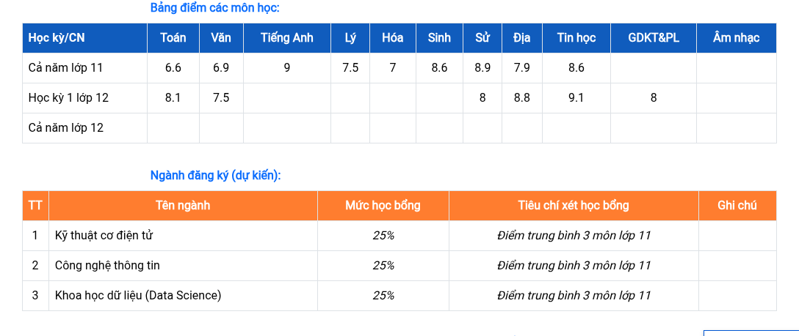

# **Nguyễn Ngọc Gia Khang**

---

### **Objective**

Aspiring software developer with hands-on experience building web and system-based applications. Strong foundation in multiple programming languages and Linux environments. Seeking an internship or entry-level role in IT or software development.

---

### **Skills**

* **Languages:** C++, Python, C#, Java, JavaScript, TypeScript
* **Web Development:** HTML, CSS, JavaScript
* **Tools:** Visual Studio, Visual Studio Code, Git
* **Platforms:** Linux (5+ years), Windows
* **Concepts:** Object-Oriented Programming, debugging, scripting, basic system design

---

### **Projects**

**VietCoffee — Café Management System & Web Platform**

* Developed a local system and web application to support café operations and online interaction
* Implemented product listing, order handling, and basic sales workflow
* Designed for both offline (local) and web-based usage
* Focused on usability and real-world business functionality

**PhenomenalaTuyenSinh247 — Vocabulary & University Info Web App**

* Built a JavaScript web application for vocabulary learning and university admission updates
* Implemented content organization and progress tracking features
* Designed dynamic system to keep information up to date
* Currently developing a scholarship search feature

---

### **Education**

* **GED (General Educational Development)** — In Progress
* **GCSE Completed**

---

### **Languages**

* Vietnamese — Native
* English — B1 Level (Certified)

---

### **Additional**

* 5+ years experience using Linux environments
* Self-taught developer with strong independent learning ability
* Interested in systems programming, web development, and cybersecurity

---
## VNGSCE (Ended in 2021)
| Môn       | Điểm kiểm tra thường xuyên | Giữa kì | Cuối kì | HK1 | HK2 | Cuối Năm |
| --------- | -------------------------- | ------- | ------- | --- | --- | -------- |
| Toán      | 9, 10, 10, 9               | 10      | 9.8     | 9.6 | 9.7 | 9.7      |
| Vật lí    | 10, 8, 9                   | 9.5     | 9.3     | 7.9 | 9.2 | 8.8      |
| Hoá học   | 8, 10, 10                  | 9.3     | 9.8     | 9.4 | 9.5 | 9.5      |
| Sinh học  | 9, 8, 10                   | 9.3     | 9.5     | 8.4 | 9.3 | 9.5      |
| Ngữ văn   | 8, 8, 9, 9                 | 7       | 8.5     | 7.9 | 8.2 | 8.1      |
| Lịch sử   | 9, 9, 10                   | 9.8     | 10      | 9.7 | 9.7 | 9.7      |
| Địa Lí    | 9, 10, 9                   | 8       | 9.5     | 9.6 | 9.1 | 9.3      |
| Ngoại ngữ | 10, 9, 9                   | 9.5     | 8.8     | 9.9 | 9.2 | 9.4      |
| GDCD      | 7, 9                       | 8.5     | 10      | 9.7 | 9.0 | 9.2      |
| Công nghệ | 10, 9                      | 10      | 10      | 9.6 | 9.9 | 9.8      |

---
## ONGOING GED (2025-2026)
| Môn        | TX1 | TX2 | GK1 | TX3 | TX4 | CK1  | TBM |
|------------|-----|-----|-----|-----|-----|------|-----|
| Địa        | 8   | 8   | 8.8 | 10  |     | 9    | 8.8 |
| Sử         | 6   | 7.5 | 7.8 | 10  | 10  | 8    | 8   |
| Toán       | 10  | 9   | 7   | 8   | 8   | 8    | 8.1 |
| Văn        | 8   | 8.5 | 8.5 | 7   | 8   | 6.3  | 7.5 |
| Công Nghệ  | 9.5 | 8   | 9.8 |     |     | 8.75 | 9   |
| Tin        | 9   | 8.5 | 8.3 | 10  |     | 9.5  | 9.1 |
| HĐTN       | Đ   | Đ   | Đ   | Đ   | Đ   | Đ    | Đ   |
| GDKTPL     | 8.5 | 9   | 8.75| 7.5 | 9   | 7    | 8   |
| GDQP       | 10 | 10   | 10  | 10 | 9   | 7    | 8   |
---

---

## 📫 联系方式 | Contact | Liên Hệ | 연락처

Email: [tomkancaston@gmail.com](mailto:tomkancaston@gmail.com)
GitHub: [https://github.com/larvenejafemcoder](https://github.com/larvenejafemcoder)
---
University Admission

